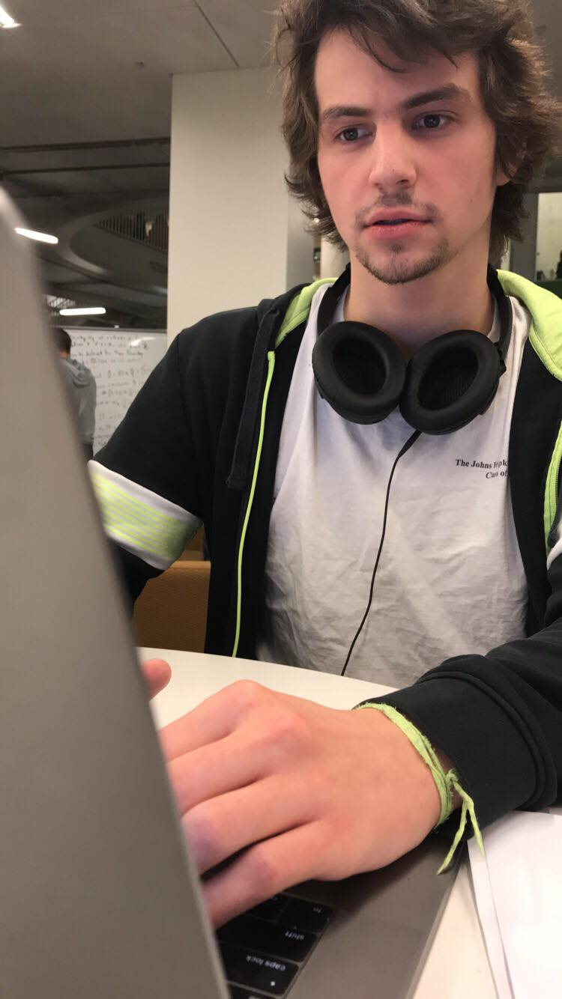

	

		

		

	

	

		

        <a href="https://medicine.wustl.edu/">Washington University School of Medicine in St. Louis</a> 
        <a href="https://neurosurgery.wustl.edu/">WUSM Neurosurgery</a> 
        <a href="https://www.leuthardtlab.com/">The Leuthardt Lab</a> 
         
        <a href="https://nyulangone.org/">New York University Langone Health</a> 
        <a href="https://med.nyu.edu/departments-institutes/neurosurgery/">NYU Neurosurgery</a> 
        <a href="https://www.nyuolab.org">OLAB</a> 
                <!--
        <a href="http://www.dbbs.wustl.edu/divprograms/BIDS/">Biomedical Informatics and Data Science</a> 
        <a href="http://mstp.wustl.edu//">Medical Scientist Training Program</a> 
		<a href="https://engineering.jhu.edu/ams/">Department of Applied Mathematics & Statistics</a> 
		<a href="https://engineering.jhu.edu/">Whiting School of Engineering</a> 
          	<a href="https://www.jhu.edu/">Johns Hopkins University</a> 
		 
		<a href="{{ BASE_PATH }}/assets/AntonAlyakinCV.pdf">CV</a> 
		<a href = "https://www.linkedin.com/in/anton-a-64a58a9b">LinkedIn</a> 
		<a href = "https://github.com/alyakin314">Github</a> 
                -->
		

	

 
 

**Status Quo**

I am currently (March 2024-March 2025) a visiting medical (MD) student
researcher at NYU [OLAB](https://www.nyuolab.org/) under the supervsion of
[Eric Oermann](https://nyulangone.org/doctors/1235498403/eric-k-oermann).
I am co-advised by [Eric Leuthardt](https://neurosurgery.wustl.edu/people/eric-c-leuthardt-md/)
at my home institution (Washington University School of Medicine in Saint
Louis). After completing this research experience, I plan to return to finish
my MD at the WUSM. At this stage of my soul-searching I am most likely to pursue
a carreer in ~~emergency medicine~~ ~~critical care~~ ~~anesthesiology~~
~~neurosurgery~~ ~~cardiac surgery~~ neurosurgery.

Research-wise, I am curious about
1. artificial intelligence, and why might neural networks have some already,
2. human intelligence, and why I might not have any still.

Most of my recent work has been on Large Language Models (LLMs), after they became cool.

Every math answer I give you is always up to a
sign/inverse/reciprocal/transpose/etc. Constants are overrated.

**Road So Far**

I graduated from Johns Hopkins University with a [BS in Computer Science](https://alyakin314.github.io/assets/papers/Alyakin_Motif_Discovery_in_the_Irregulary_Sampled_Time_Series_Data.pdf)
in May 2019 and an [MSE in Applied Mathematics & Statistics](https://jscholarship.library.jhu.edu/server/api/core/bitstreams/f33e2b8e-d18d-4a03-b14c-bede28b441ec/content)
in December 2019.
While a student there I was fortunate to be advised by
[Suchi Saria](https://suchisaria.jhu.edu/) and
[Avanti Athreya](https://engineering.jhu.edu/ams/faculty/avanti-athreya/).

During ~~COVID~~ my gap year I worked as an Assistant Research Engineer at my
alma mater's Department of Applied Mathematics & Statistics. I was a part of the
[NeuroData](https://neurodata.io/) lab and primarily worked with
[Carey Priebe](https://www.ams.jhu.edu/~priebe/) on various problems in
statistical graph inference and with [Joshua Vogelstein](https://jovo.me/) on
causal inference from observational health data.

I started an MD-PhD program at Washington University School of Medicine in 2021,
but later decided to only pursue the first two letters out of five.

My research interests outsode of LLMs&Neurosurgery include statistical inference
on connectome networks, diagnostic and prognostic clinical decision support
tools, among other intersections of statistics and medicine.

<!--
I consider myself a frequentist in philosophy, but a Bayesian in practice.

I probably don't understand determinism...
-->
