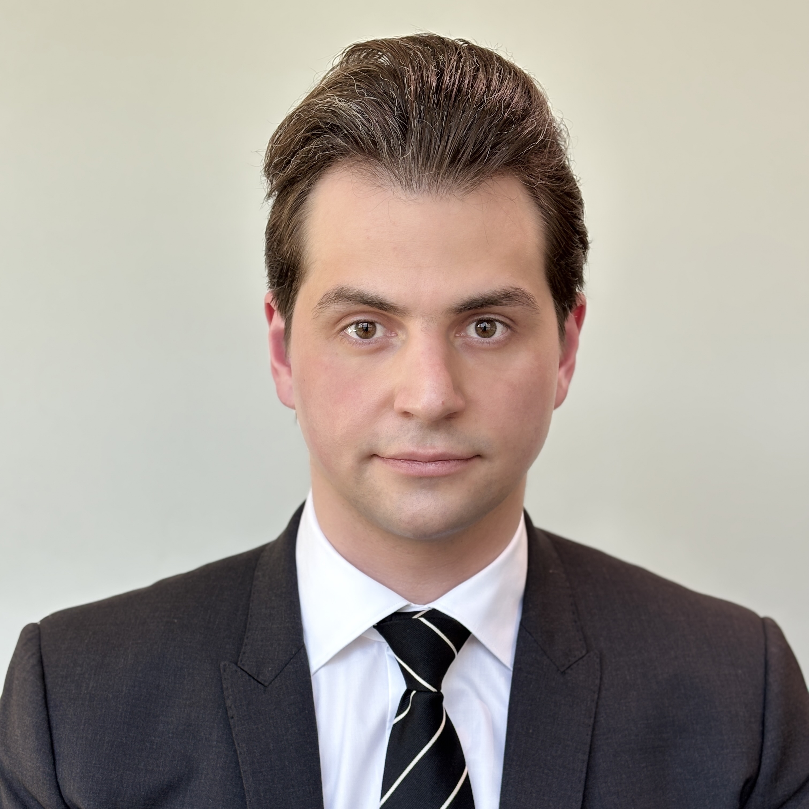

	

		

		

	

	

		

        <a href="https://medicine.wustl.edu/">Washington University School of Medicine</a> 
                <!--
		<a href="https://engineering.jhu.edu/ams/">Department of Applied Mathematics & Statistics</a> 
		<a href="https://engineering.jhu.edu/">Whiting School of Engineering</a> 
          	<a href="https://www.jhu.edu/">Johns Hopkins University</a> 
		 
		<a href="{{ BASE_PATH }}/assets/AntonAlyakinCV.pdf">CV</a> 
		<a href = "https://www.linkedin.com/in/anton-a-64a58a9b">LinkedIn</a> 
		<a href = "https://github.com/alyakin314">Github</a> 
                -->
		
		
	

 
 

I am an (all but officially committed) incoming MD-PhD student at the Washington
University School of Medicine in St. Louis. My primary research interests are
development of diagnostic clinical decision support tools and other
intersections of machine learning and medicine.

I graduated from Johns Hopkins University with a BS in Computer Science in
May 2019 and an MSE in Applied Mathematics & Statistics in December 2019. 
During my time as a student I was fortunate to be advised by
[Suchi Saria](https://suchisaria.jhu.edu/) and
[Avanti Athreya](https://engineering.jhu.edu/ams/faculty/avanti-athreya/).

In ~~COVID~~ my gap year I worked as an Assistant Research Engineer at my alma
mater's Department of Applied Mathematics & Statistics. I was a part of the
[NeuroData](https://neurodata.io/) lab and primarily worked with
[Carey Priebe](https://www.ams.jhu.edu/~priebe/) on various problems in
statistical graph inference and with [Joshua Vogelstein](https://jovo.me/) on
causal inference from observational health data.

I consider myself a frequentist in philosophy, but a Bayesian in practice.

